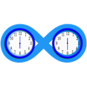

# Timed Silver

**Work in progress (Alpha + known bugs). I use it myself.** A clock manager: timers, alarms. In future, a visual time programming tool.
Written with Windows, Visual Studio, C# and WPF.

**Longer description:** A growing user-friendly PC timer and alarm program. Manages multiple countdown timers and alarms. Each timer or alarm can have a custom tag, icon, color etc. The zoom, sound, ringing duration and other things are customizable. You can select a custom background image. Each timer can be opened in its own big or small window. There is drag & drop functionality, a data grid view. The timers can be put in groups (which work like folders), and there are 4 basic filters for them: Active, Inactive, Alarms and Timers (and All).

## Features

* countdown timers with text tags, custom icons
* autoopen last file setting
* full-screen time up window
* customizable sound and beeps table
* zoom toolbar working with multiple views
* recent audio files menu and recent image files menu
* drag & drop reordering of timers
* normal theme & dark theme
* customizable ringing duration
* zoom level remembered in open file
* optional autosort by closest ringing moment
* system clock in full-screen mode in bottom-right corner
* file open, save, save as, new, autosave, autoopen
* window options: always on top; on top until restart
* custom back color & icon for each of the timer controls
* custom view type: flow view, data grid
* clock group list pane
* rounded corners setting
* optional autosort alphabetically
* system tray menu: item & shortcuts for Start/Stop on every timer
* always mute setting and temporary un/mute button

## Roadmap
**(no deadlines yet)**

* Canvas mode
* Visual grouping
* Functional arrows
* Timeline
etc.

## What it is and what it is not

Yes, this may become a platform, about time. No problem about complexity, extensibility it becomes, and UI will be kept pretty simple also using a little AI.

## Directory structure

* `Light.xaml` and `Dark.xaml` - my attempt at making XAML themes, mostly based on the default control templates and including templates/styles for some of my custom (user) controls, probably I will replace them with actual existing themes.
* The tests project is totally not working.

## User guidelines

The user documentation is [here](Source/cs-timeout/Docs/Help.md). Please open an issue if you have any question, suggestion etc.

## Contributor guidelines

Your time will not be wasted if you get involved. Please open an issue if you have any question. Do not work on something before making sure you get my accept to work on that feature and possibly merge the pull request. In general, I support my own vision, but I am very open to other opinions, solutions to bugs and new features that do not block existing ones.

See [Contributing](CONTRIBUTING.md) for information about how to contribute!

## Tasks

I know the docs (for both users & contributors) are not good at all. I accept suggestions and issues, then pull requests about this.

## Credits

A lot of good questions and answers on StackOverflow, Software Engineering.SE and other websites. Links to some of them:

*  https://stackoverflow.com/a/55610749/258462
*  https://www.codeproject.com/Articles/17266/Drag-and-Drop-Items-in-a-WPF-ListView
*  https://www.c-sharpcorner.com/UploadFile/nipuntomar/wpf-datagrid-style/
*  https://www.codeproject.com/Articles/109531/Controlling-and-Viewing-the-ScrollBar-Positions-of
*  https://stackoverflow.com/a/57844838/258462
*  https://blogs.msdn.microsoft.com/mgrayson/2007/02/16/creating-a-glass-button-the-complete-tutorial/
*  https://stackoverflow.com/a/836463/258462
*  https://www.codeproject.com/Questions/677506/Csharp-find-the-majority-color-of-an-image
*  https://stackoverflow.com/a/3875619/258462
*  https://stackoverflow.com/a/21389253/258462
*  https://stackoverflow.com/questions/3449564/how-to-get-the-visible-bounds-of-a-panel

I also used other software components and applications to create Timed Silver. Some of them:

* SvgToXaml
* Oxygen Icon Set
* [icons8](https://icons8.com/icons/)
* [icons mind](https://iconsmind.com/)
* Inkscape
* Visual Studio
* [Markdown.Xaml](https://github.com/theunrepentantgeek/Markdown.XAML)
* other NuGet dependencies
    * Extended WPF Toolkit
    * AvalonDock
    * NAudio
    * gong-wpf-dragdrop
	* [HandyControls](https://github.com/ghost1372/HandyControls)
    * Prism

## Donate

## License

Licensed under the MIT License.

Since 13rd of October, 2019, © 2019 Timed Silver contributors

Before:
© 2018-2019 Silviu Bogan