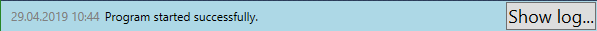

# How to use Timed Silver

 ***NOTE:** This documentation is work in progress. Any help on this is appreciated.*

You can move the mouse cursor over buttons, labels etc. and there may appear a text (tooltip) that may help you use the program. There are many keyboard accelerators which can be used to command the program (press the left Alt key while looking at the menus).

## The visible user interface

* The menus

* The toolbars
  * The zoom toolbars look like this: 

  * The sort toolbar: 

  * The edit toolbar: 

* The Dark theme and Full-screen check boxes

* The clocks views – just an example:

* The status bar (the message shown at the start of the program)

---

You can add multiple timers using the **clepsydra button "New timer" ** which stays initially in the **Edit tool bar** at the top of the window. Each timer can be part of one group, can have a custom icon, a custom background color and its ID is determined by its position in the current applied filter. Each timer has the option to be reset to a custom or automatically determined reset-to value, and the reset-to value can be locked. The great majority of settings (each timer’s settings included) are saved to the opened or saved XML file (including the visible applied filter). The file becomes unsaved very fast because each timer’s ticks cause it to be marked as unsaved. The menu items in the File menu have keyboard shortcuts (including `Ctrl+S` for save).

You can zoom in and zoom out using the global zoom toolbar (automatically shown and unhideable). Each zoom toolbar has a **zoom track bar** and the **zoom in/out/reset buttons** (the zoom in & out buttons can be long-clicked and the zoom will proceed automatically). The zoom limits are 1% and 400%. After being shown, the toolbars can be moved (their position will not be saved to file in this version of the program).

There is also an unhideable sort toolbar which has the option to automatically sort the timers by the soonest ringing or to not sort the timers automatically.

There are 2 check buttons under the top toolbars called:

* **"Full-screen"** which will open a full screen window instead of an user-sized window for the program. Nothing will be lost by doing or undoing this.
* **"Dark theme"** (or night mode) which changes the colors of the program.

On the first opening, a text control with yellow background color will guide you to the **File > Save as...** menu item. In general, the last open file will be the file opened at the next start of the program. In general, there is at least one timer control created automatically. You can also delete and reorder timers, but the IDs in the left side of the timers will remain in the same order.

----

At the bottom of the window there is a status bar. There is also an "Edit" tool bar with 2 buttons: the *New Timer* button described above and the *Properties* button which opens the *Settings* window with settings that are saved in the current file:

* Audio file
* Ring for (ringing duration)
* Autosave (*yes* or *no*)
* Autosave every (a time span settable only when Autosave is set to yes – checked check box)
* Zoom group list tool strip
* Enable rounded corners (for timer views in list view) and
* Two global setting (the only ones not saved in the current XML file) called
    * *Autoopen last file on program start*
    * *Start program Timed Silver with Windows*
* Beeps table – a table with beeps (small sounds) that are heard at specific moments before a timer rings (currently the function is only available for Timers, not for Alarms). Each beep has a moment when it rings, specified in milliseconds before the timer rings, a duration (in milliseconds) and a frequency (ranging from 37 to 32767 hertz). Beeps are hearable at values close to a frequency of 800 hertz and a duration of 200 milliseconds. Example table:

**NOTE:** this screenshot is very old and needs to be updated after the beeps table works in the latest version of the application.

etc.

You can set the audio file used as alarm sound in the entire program with the **"Set audio file..."** button. In the right side of this button there is an arrow button that will show a list of the most recently used alarm sound file paths. In the right of this button there is shown the path of the currently selected audio file, or "Default sound", **a button that plays/stops** the sound for testing, and a **reset button** for the selected sound.

## The menus

### The menu File

contains actions: **New, Open, Save, Save As, Properties, Recent Files... (submenu), Open Containing Folder..., Restore to Previous Day..., Advanced...** and **Exit**.

In the **Advanced...** submenu there are three options:

There are keyboard shortcuts for many of these menu items shown on the right side of each of them.

### The menu Edit

contains **Remove All Clocks...**, **Multiple Selection in List View** (checkable) and **Stop All Timers...**.

### The menu View

**NOTE:** some of this menu's items do not work well or do not work at all and this section of the documentation is not yet updated.

The **View** menu contains items to switch to one of three types of views:

* **Flow** (list) view
* **Data grid** view
* **Group list** view

The **View** menu also contains 2 items to focus on one part/type of view in the case of a split view, and a zoom toolbars’ visibility submenu.

### The menu Window

contains **Keep on Top > Always** and **Keep on Top > Until Next Restart** and similar options. A timer label is displayed in the **Keep on Top...** menu item when such a timer is active.

### The menu Help

contains the **Help** menu item which can be opened using **F1 key** and an **About...** item.

## The flow view

Shows by default all clocks together (countdown timers and alarms). See the **Multiple Selection in Flow View** and the **The clock view** sections.

## The data grid view

* The **Type** column contains either "Timer" or "Alarm", and the type can be changed using the drop-down menu.
* The **Icon** column only shows the selected icon of the clock (row). To change the icon, use the context menu (right mouse click).
* The **Tag** column is editable by clicking on one of its cells.
* The **Current Value** tag shows the current value of the clock. If the clock is a timer, it shows a time span, else if the clock is an alarm, it shows a date and time. The value is editable.
* The **Unsaved** column is read-only.
* By clicking on a cell in the **User Back Color** column, a color chooser window opens. On single click on the cell, the value is editable as a string in format "#AARRGGBB" (Alpha, Red, Green, Blue, all are 2-digit hexadecimal numbers).
* The **Group Name** column allows choosing from existing groups and if the typed value is inexisting, the group with that name is created. It is also possible to select *No Group*.
* The **Reset-to Value** column works like the Remaining Time Span column in selection, editing, saving, but it has a different meaning. See the section **The clock view**.
* The **Reset-to Value Locked** column specifies whether the reset value should not be changed automatically from this moment on.
* The last two columns are buttons: the red X is a delete-row button, the second button in each row is start/stop for timers or activate/deactivate for alarms.

There is also a context menu option in plus besides the context menu options available in other views. This option is the only option when right clicking on the top-left empty cell of the table. It either makes the **Tag** column to fill the table width, or not.

## The Group List view

is a panel in the left side of the window, in which there are reorderable, multiselectable, renameable group names and first in the list are 5 basic filters: **All**, **Active**, **Inactive**, **Timers**, **Alarms**).

After being made visible, it has 2 buttons at the top of it: **New group** (opens a small dialog window in which the user can enter a title for the newly created group of timers) and **Delete group** (after selecting a group in the list box below these buttons, this option deletes the selected group).

To activate an option in the list of filters and groups, select them and double click, or just double click. By double clicking on groups in the list view, only that respective group is shown. A group can be renamed by right clicking on it and selecting the **Rename** menu item. You can select multiple groups with `Ctrl-click` or checking the check boxes near them.

Right click on an user-made group shows this context menu:

**NOTE:** The screenshot above shows a bug: *Stack* group view is selected but *Large icons* group view is shown.

## The Properties window

*(initially called Settings, this window hosts **mostly** file-scoped settings, that means that if you change a setting it is saved to the open file, not to the global user or application-level storage)*

The file-choosing settings also allow drag & drop. The file choosers also have a recent-files menu. The beeps table currently works only with timers (not with alarms). Double click on an empty cell to edit it or add a new row. Column headers have helpful tooltips.

## The Import window

**NOTE:** This window is not working well in the latest version, it crashes the program when it should show up.

In this version of the program the beeps table cannot be imported.

## Multiple Selection in Flow View

When this option is enabled, a multiselect header appears at the top of the clock list view:

Initially no clocks are checked.

It is enabled in the *Edit* menu using the last item: *Multiple Selection in List View*. If the currently selected view type is a split view, selection inside the data grid view is synchronized with the selection inside the clock list view. Using `Ctrl` or `Shift` selection in data grid view works, even when the clock list view is not visible, by using the right mouse button over a selected clock, action which shows the common context menu.

## The full-screen Time-Out Window

It tells the tag of the timer that rings, the duration of the ringing until the current moment, it has 4 buttons: **Reset & close**, **Restart & close**, **Close without reset** and **Snooze** (**Snooze** resets the timer to the specified time span in this full-screen window).

## The clock view

In the left there is an ID (unique between the visible clocks), a text box with placeholder "Enter text here...", a time span/date time picker element, a delete button and a start/stop button, a drag-drop move handler and a Menu button containing a menu with the options:

* **Reset to [...]...** – On simple click, this resets the time span picker to the value specified in it (it has a text such as *Reset to 00:10:00...*) and closes the timer view’s main menu. It also has a submenu which can lock the reset value, or if it is not locked (the default), it will be updated on each start of the timer. The progress of the soonest ringing timer is shown on the task bar based on its reset value.
* **Select color...** – this opens a color dialog to let the user select a custom back color for the timer view.
* **Delete user color** – this removes the custom user-set back color of the timer view.
* **Groups...** – this shows a submenu in which you can select that the timer is part of an existing or a new group.
* And many others.

## For more help

The project is hosted on GitHub [here](https://github.com/silviubogan/timed-silver) and has an issue tracker. The official website, [here](https://timedsilver.wordpress.com/), has a contact form. 